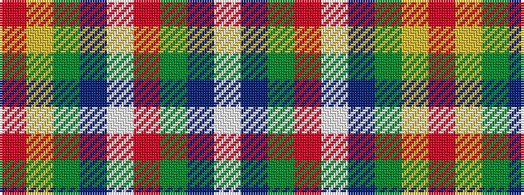

RYGBWRGBW

It is a 9 stripe tartan.

<figure class="pat-woven">

<figcaption>idealised sample</figcaption>
</figure>

## Colour Sequence



## Tartans with this colour sequence

| Tartans |
|---------------|
| [Drummond of Perth Dress #2](/variants/s9/r41ly3y7db3w24r10y7db7w3~x2/)|
||
