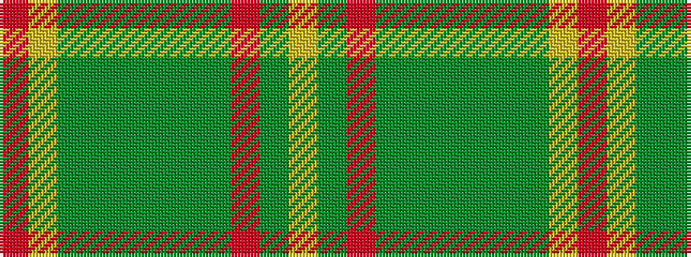

RYGGGGGGRGY

It is a 11 stripe tartan.

<figure class="pat-woven">

<figcaption>idealised sample</figcaption>
</figure>

## Colour Sequence



## Tartans with this colour sequence

| Tartans |
|---------------|
| [Tasmanian](/variants/s11/m2lr1dg12y1dg1y1dg3y4m3y4ly2~x4/)|
||
