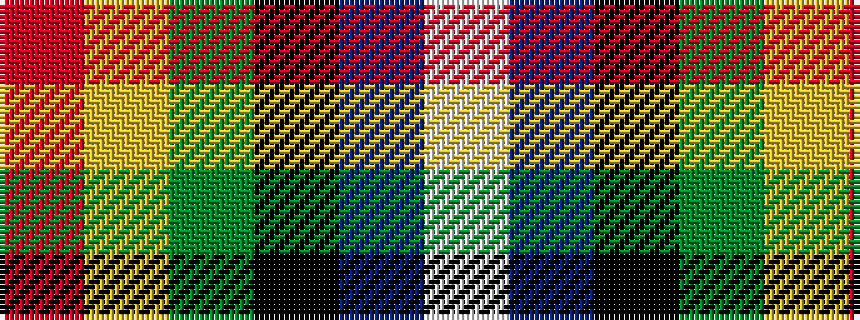

RYGKBW

It is a 6 stripe tartan.

<figure class="pat-woven">

<figcaption>idealised sample</figcaption>
</figure>

## Colour Sequence



## Tartans with this colour sequence

| Tartans |
|---------------|
| [Jamestown Parish Church (Corporate)](/variants/s6/r3ly2g12k12db14w3~x2/)|
||
