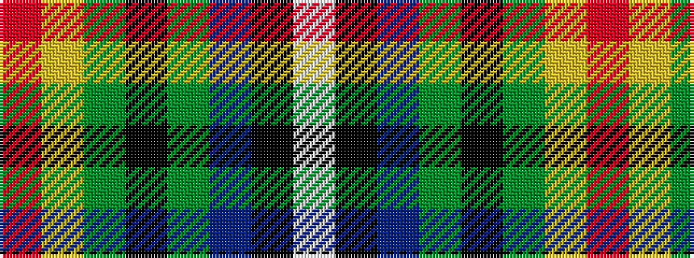

RYGKGBKW

It is a 8 stripe tartan.

<figure class="pat-woven">

<figcaption>idealised sample</figcaption>
</figure>

## Colour Sequence



## Tartans with this colour sequence

| Tartans |
|---------------|
| [Iowa (District)](/setts/s8/r4ly3g12k16dy5db20k4w2~x2/)|
||
