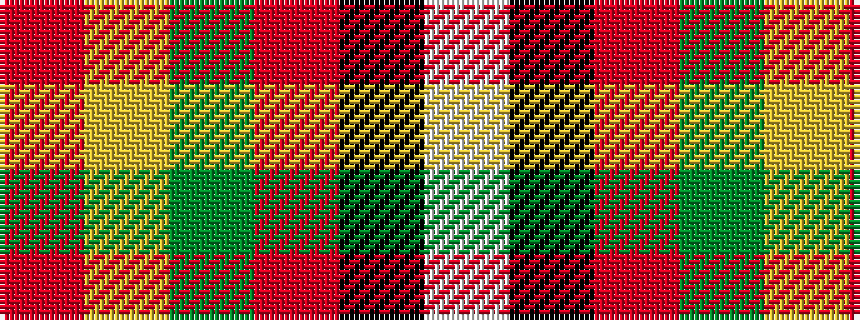

RYGRKW

It is a 6 stripe tartan.

<figure class="pat-woven">

<figcaption>idealised sample</figcaption>
</figure>

## Colour Sequence



## Tartans with this colour sequence

| Tartans |
|---------------|
| [Reekie, Charlene](/setts/s6/w43k5r3dg5ly27m5~x2/)|
||
