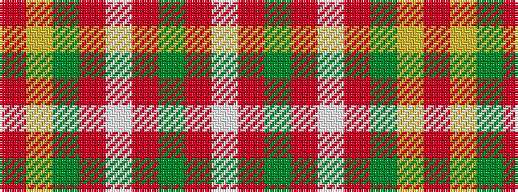

RYGRWRGRW

It is a 9 stripe tartan.

<figure class="pat-woven">

<figcaption>idealised sample</figcaption>
</figure>

## Colour Sequence



## Tartans with this colour sequence

| Tartans |
|---------------|
| [Manx Laxey, Red](/setts/s9/r24ly2y3o2w10r4y3o3w2~x2/)|
||
