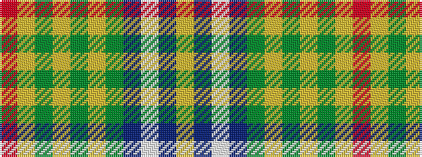

RYGYGYGBWBY

It is a 11 stripe tartan.

<figure class="pat-woven">

<figcaption>idealised sample</figcaption>
</figure>

## Colour Sequence



## Tartans with this colour sequence

| Tartans |
|---------------|
| [Bruntsfield Links Golfing Society](/setts/s11/r6lg22g8lg4g12lg2g18db8lt12db35ly4/)|
||
