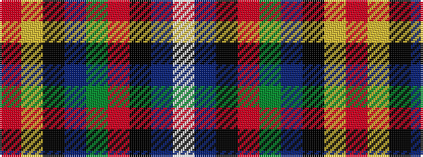

RYKBGRKBW

It is a 9 stripe tartan.

<figure class="pat-woven">

<figcaption>idealised sample</figcaption>
</figure>

## Colour Sequence



## Tartans with this colour sequence

| Tartans |
|---------------|
| [Drummond Ancient](/variants/s9/r19ly1k2t1dg7r2k1t1w1~x4/)|
||
| [Drummond, Ancient](/variants/s9/r19ly1k2t1g7r2k1t1w1~x4/)|
||
