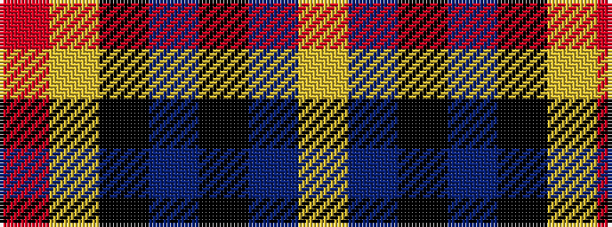

RYKBKBY

It is a 7 stripe tartan.

<figure class="pat-woven">

<figcaption>idealised sample</figcaption>
</figure>

## Colour Sequence



## Tartans with this colour sequence

| Tartans |
|---------------|
| [City of Rome Pipe Band (Corporate)](/setts/s7/r12lo6k88db45k6db6ly6/)|
||
