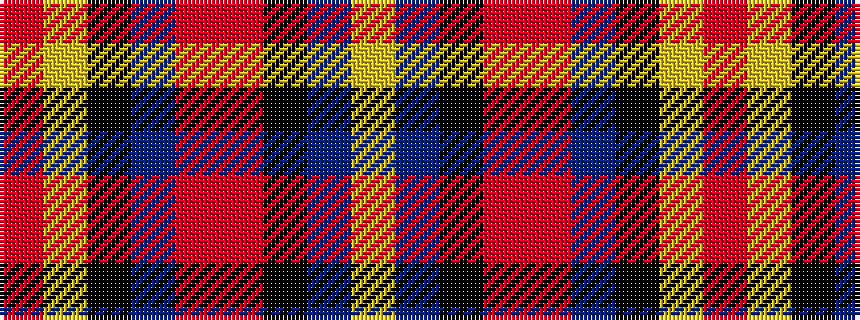

RYKBRRKBY

It is a 9 stripe tartan.

<figure class="pat-woven">

<figcaption>idealised sample</figcaption>
</figure>

## Colour Sequence



## Tartans with this colour sequence

| Tartans |
|---------------|
| [Inches, of Perth](/setts/s9/o44ly2k4p2o15r6k3t3ly2~x2/)|
||
