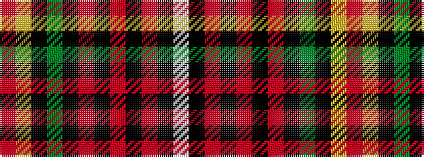

RYKGKRKRKRKW

It is a 12 stripe tartan.

<figure class="pat-woven">

<figcaption>idealised sample</figcaption>
</figure>

## Colour Sequence



## Tartans with this colour sequence

| Tartans |
|---------------|
| [Tweedmouth Middle School](/setts/s12/m30ly1k2g10k1r3k1r3k1r3k1w1~x2/)|
||
