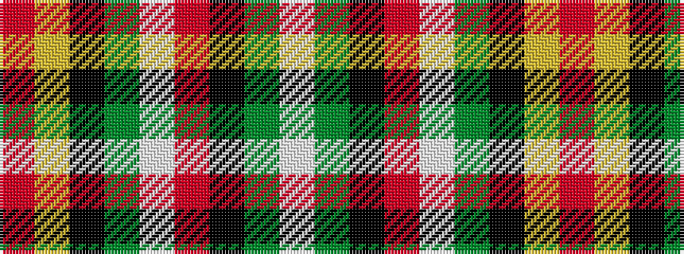

RYKGWRKGW

It is a 9 stripe tartan.

<figure class="pat-woven">

<figcaption>idealised sample</figcaption>
</figure>

## Colour Sequence



## Tartans with this colour sequence

| Tartans |
|---------------|
| [Drummond of Perth Dress](/setts/s9/r40ly1k2y1w15r5k5y5w1~x2/)|
||
