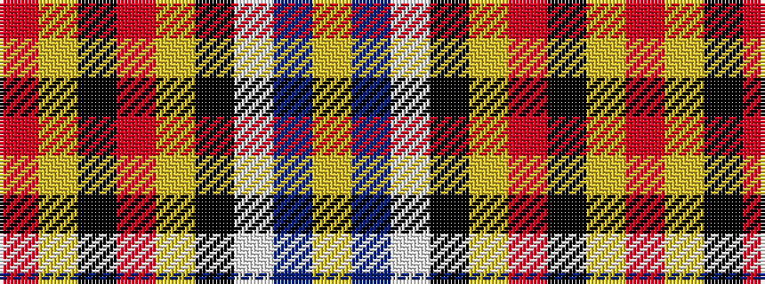

RYKRYKWBY

It is a 9 stripe tartan.

<figure class="pat-woven">

<figcaption>idealised sample</figcaption>
</figure>

## Colour Sequence



## Tartans with this colour sequence

| Tartans |
|---------------|
| [Tipperary County Crest (Fashion)](/variants/s9/r10lr36k24r30lo8k16w18db16lo9/)|
||
