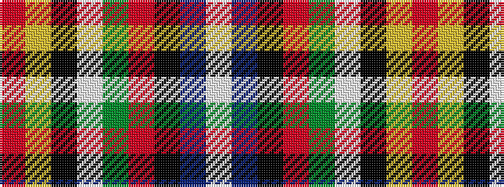

RYKWGRKBW

It is a 9 stripe tartan.

<figure class="pat-woven">

<figcaption>idealised sample</figcaption>
</figure>

## Colour Sequence



## Tartans with this colour sequence

| Tartans |
|---------------|
| [Drummond of Perth](/variants/s9/r51ly2k4w2g21r10k4t4w2~x2/)|
||
