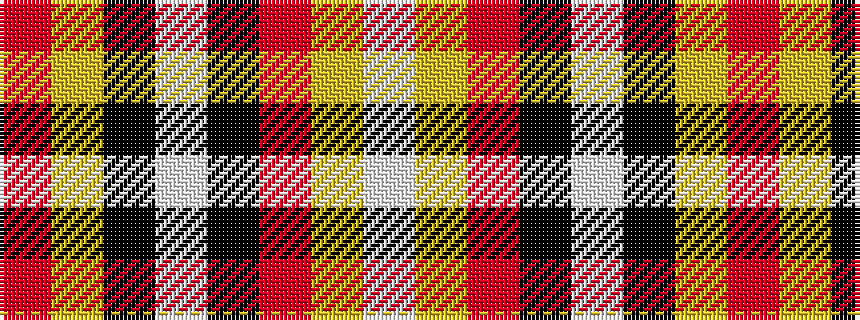

RYKWKRYW

It is a 8 stripe tartan.

<figure class="pat-woven">

<figcaption>idealised sample</figcaption>
</figure>

## Colour Sequence



## Tartans with this colour sequence

| Tartans |
|---------------|
| [Lock in Northumberland (Name)](/setts/s8/r90lr1k2lb10k5r2lr2lb2~x2/)|
||
