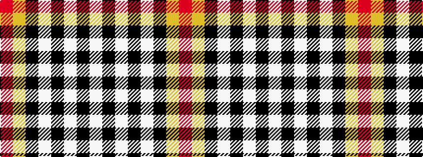

RYKWKWKW

It is a 8 stripe tartan.

<figure class="pat-woven">

<figcaption>idealised sample</figcaption>
</figure>

## Colour Sequence



## Tartans with this colour sequence

| Tartans |
|---------------|
| [Holden Beige (Corporate)](/variants/s8/lb13k3lb3k3lb3k15lo18r3~x2/)|
||
