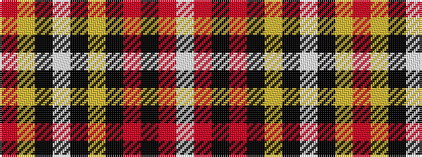

RYKWKYKRKRW

It is a 11 stripe tartan.

<figure class="pat-woven">

<figcaption>idealised sample</figcaption>
</figure>

## Colour Sequence



## Tartans with this colour sequence

| Tartans |
|---------------|
| [Stevens #5](/setts/s11/o53ly6k10w3k3ly4k10r8k3r6w3/)|
||
