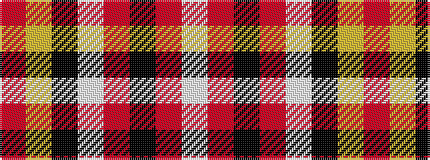

RYKWRKRW

It is a 8 stripe tartan.

<figure class="pat-woven">

<figcaption>idealised sample</figcaption>
</figure>

## Colour Sequence



## Tartans with this colour sequence

| Tartans |
|---------------|
| [Golden Wedding (Fashion)](/setts/s8/r8lo44k32w2o52k7o7w3/)|
||
