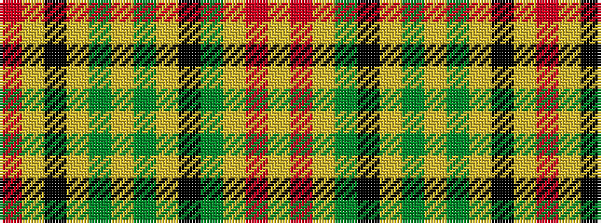

RYKYGYGYKGYRY

It is a 13 stripe tartan.

<figure class="pat-woven">

<figcaption>idealised sample</figcaption>
</figure>

## Colour Sequence



## Tartans with this colour sequence

| Tartans |
|---------------|
| [Balmoral](/variants/s13/lr4r2lr11y2k2lr1y1lr1y4lr2k1lr1r1~x2/)|
||
