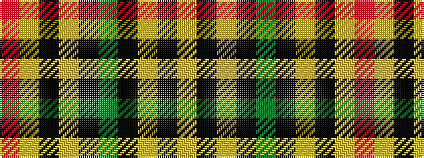

RYKYKGKYKY

It is a 10 stripe tartan.

<figure class="pat-woven">

<figcaption>idealised sample</figcaption>
</figure>

## Colour Sequence



## Tartans with this colour sequence

| Tartans |
|---------------|
| [Project, Faith Inc (Corporate)](/setts/s10/ly22k11ly10k2g2k2ly10k11ly7r2~x2/)|
||
