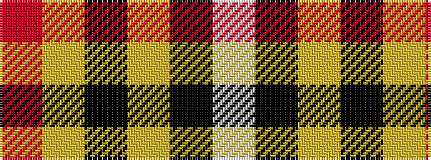

RYKYKW

It is a 6 stripe tartan.

<figure class="pat-woven">

<figcaption>idealised sample</figcaption>
</figure>

## Colour Sequence



## Tartans with this colour sequence

| Tartans |
|---------------|
| [Livingston Football Club (2001)](/setts/s6/w4k24ly5k10ly12r1~x2/)|
||
