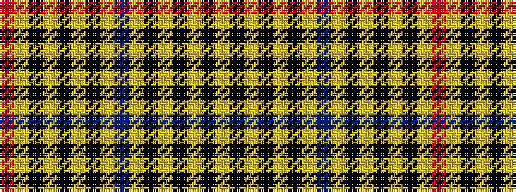

RYKYKYKYBYKYKYKY

It is a 16 stripe tartan.

<figure class="pat-woven">

<figcaption>idealised sample</figcaption>
</figure>

## Colour Sequence



## Tartans with this colour sequence

| Tartans |
|---------------|
| [Cardiff City Football Club](/variants/s16/lo24k13lo2k4lo3k1lo3t2lo3k1lo3k4lo2k13lo24r4~x2/)|
||
