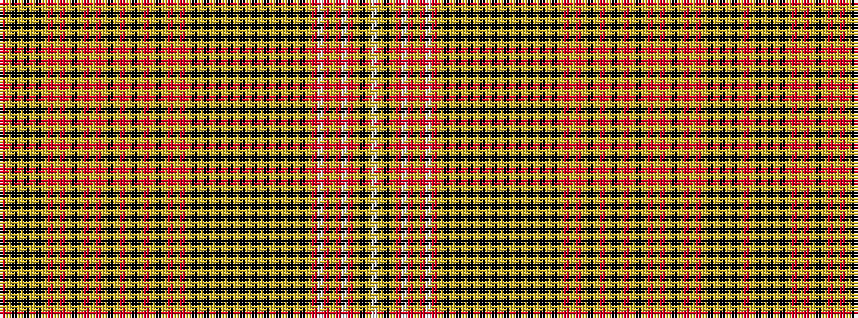

RYKYKYKYRYRYKYRYRYKYRYKYRYKYRYRYKYKYKYKYKYKYKYKYKYKYRWRYRWRYKYW

It is a 63 stripe tartan.

<figure class="pat-woven">

<figcaption>idealised sample</figcaption>
</figure>

## Colour Sequence



## Tartans with this colour sequence

| Tartans |
|---------------|
| [Murray, Mungo](/setts/s63/o10ly4k2ly2k2ly2k2ly4r1ly2r1ly4k4ly3r7ly3r7ly1k1ly1r7ly1k1ly1r7ly1k1ly1r7ly3r7ly3k4ly4k2ly2k2ly4k4ly6k2ly6k2ly6k2ly6k2ly6k2ly6k10ly4o1w2o1ly2o1w2o1ly4k6ly1w2~x2/)|
||
