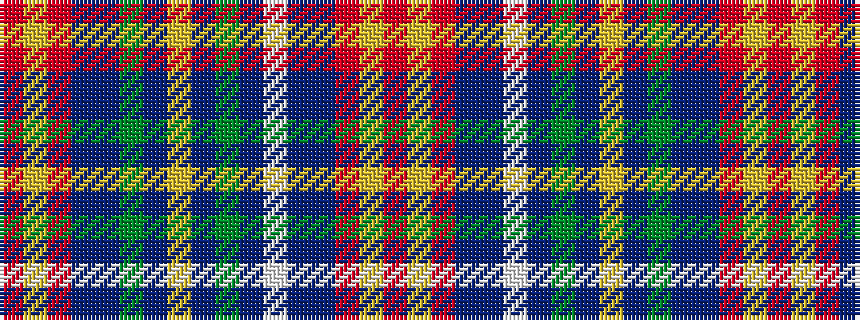

RYRBBGBYBGBWBBRYR

It is a 17 stripe tartan.

<figure class="pat-woven">

<figcaption>idealised sample</figcaption>
</figure>

## Colour Sequence



## Tartans with this colour sequence

| Tartans |
|---------------|
| [Stevens (Personal)](/setts/s17/r6ly3r3db24db24g24t3ly4t3g24db10w3db10db24r3ly3r6/)|
||
