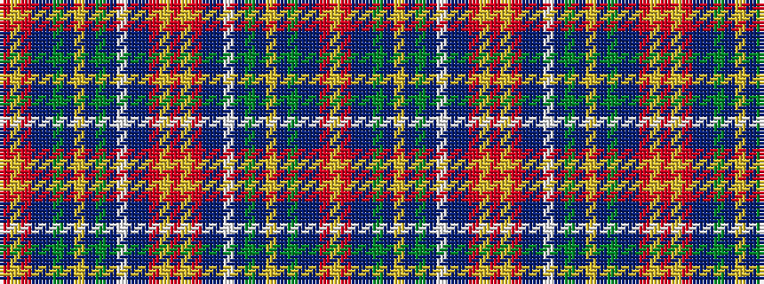

RYRBBGBYBGBWBBRYRYRBBWBGBYBGBBRY

It is a 32 stripe tartan.

<figure class="pat-woven">

<figcaption>idealised sample</figcaption>
</figure>

## Colour Sequence



## Tartans with this colour sequence

| Tartans |
|---------------|
| [Stevens (Personal)](/variants/s32/r6ly3r3db24dbi24g24t3ly4t3g24dbi10w3dbi10db24r3ly3r6/)|
||
