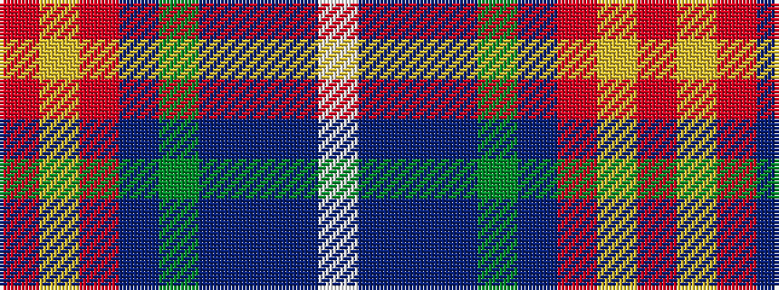

RYRBGBBBW

It is a 9 stripe tartan.

<figure class="pat-woven">

<figcaption>idealised sample</figcaption>
</figure>

## Colour Sequence



## Tartans with this colour sequence

| Tartans |
|---------------|
| [Heirloom Red Alba (Fashion)](/variants/s9/r4ly2r34db10y4db4t4db23w3~x2/)|
||
