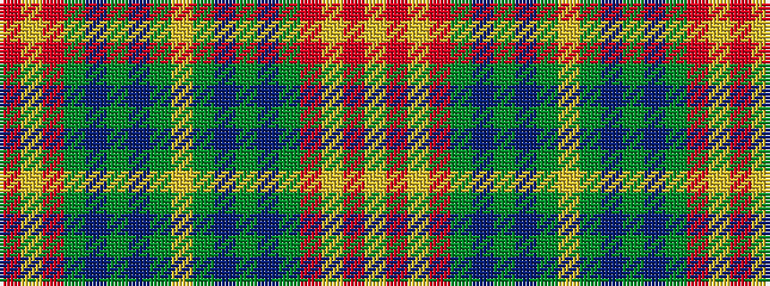

RYRGBGBGYGBGBGRYRY

It is a 18 stripe tartan.

<figure class="pat-woven">

<figcaption>idealised sample</figcaption>
</figure>

## Colour Sequence



## Tartans with this colour sequence

| Tartans |
|---------------|
| [Rice of Wales](/setts/s18/r21lo1r21y8db4y5db4y4lo4y4db4y5db4y8r21lo1r21lo4~x2/)|
||
