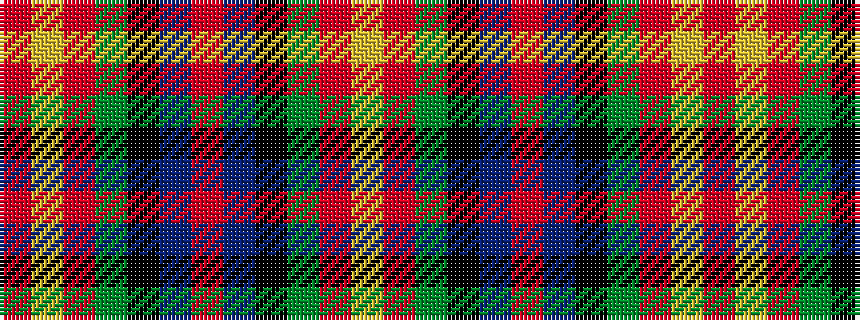

RYRGKBRBKGRY

It is a 12 stripe tartan.

<figure class="pat-woven">

<figcaption>idealised sample</figcaption>
</figure>

## Colour Sequence



## Tartans with this colour sequence

| Tartans |
|---------------|
| [Sturrock (Blue/Black)](/setts/s12/r52b16k16g22r16lo3r16~x2/)|
||
