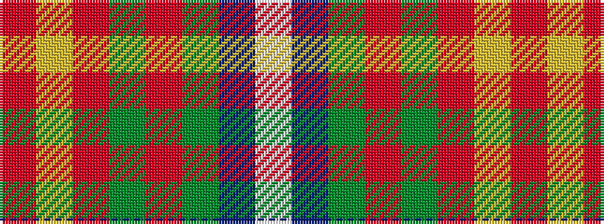

RYRGRGBW

It is a 8 stripe tartan.

<figure class="pat-woven">

<figcaption>idealised sample</figcaption>
</figure>

## Colour Sequence



## Tartans with this colour sequence

| Tartans |
|---------------|
| [21st Century (Fashion)](/variants/s8/w4dt38g6r2g6r38lo2r3~x2/)|
||
| [Scotland 2000](/variants/s8/m5ly2m35g6m2g6db38w4~x2/)|
||
| [Scotland 2000 Commemorative Tartan](/variants/s8/w4t30g6r2g6r28ly2r3~x2/)|
||
