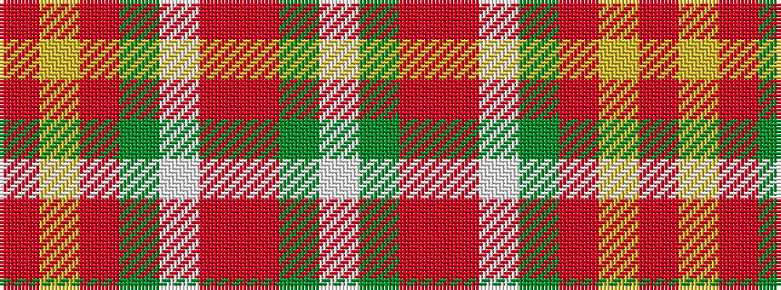

RYRGWRRGW

It is a 9 stripe tartan.

<figure class="pat-woven">

<figcaption>idealised sample</figcaption>
</figure>

## Colour Sequence



## Tartans with this colour sequence

| Tartans |
|---------------|
| [Manx Laxey (Red)](/variants/s9/r24ly2o3dy2w10r4o3dy3w2~x2/)|
||
