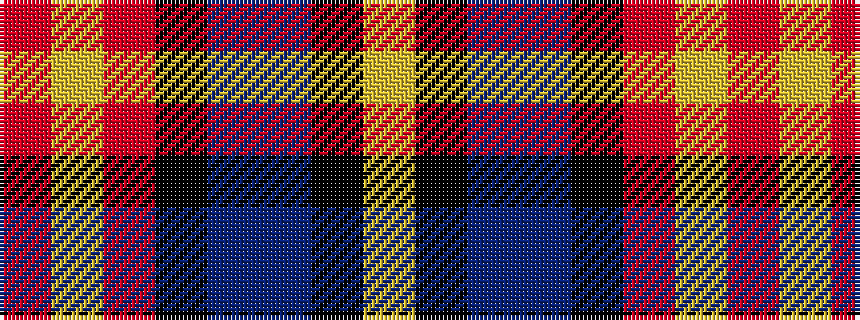

RYRKBBKY

It is a 8 stripe tartan.

<figure class="pat-woven">

<figcaption>idealised sample</figcaption>
</figure>

## Colour Sequence



## Tartans with this colour sequence

| Tartans |
|---------------|
| [Lovell (2014)](/setts/s8/lo2k2dbi14db4k5r2lo5r1~x4/)|
||
| [Lovell (2014)](/setts/s8/ly2k2dbi14db4k5r2ly5r1~x4/)|
||
