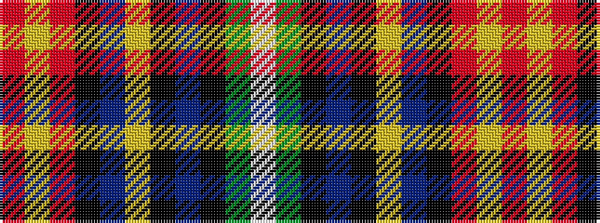

RYRKBYKBKGW

It is a 11 stripe tartan.

<figure class="pat-woven">

<figcaption>idealised sample</figcaption>
</figure>

## Colour Sequence



## Tartans with this colour sequence

| Tartans |
|---------------|
| [State Seal of Kentucky (Fashion)](/variants/s11/lb6g13k12b3k3lo3b30k3o11lo3o5~x2/)|
||
