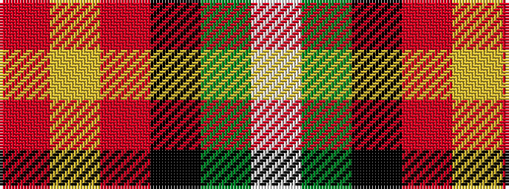

RYRKGW

It is a 6 stripe tartan.

<figure class="pat-woven">

<figcaption>idealised sample</figcaption>
</figure>

## Colour Sequence



## Tartans with this colour sequence

| Tartans |
|---------------|
| [Aboyne II (Fashion)](/variants/s6/r2ly1r5k4g5w1~x4/)|
||
