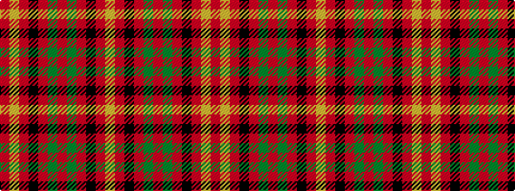

RYRKRGRGRKRY

It is a 12 stripe tartan.

<figure class="pat-woven">

<figcaption>idealised sample</figcaption>
</figure>

## Colour Sequence



## Tartans with this colour sequence

| Tartans |
|---------------|
| [Kirk](/variants/s12/r4g21r4k7r34lo3r4~x2/)|
||
