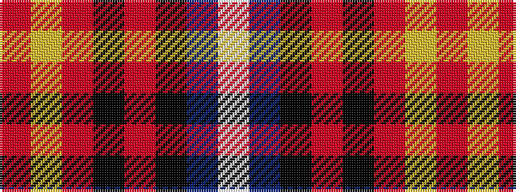

RYRKRKBW

It is a 8 stripe tartan.

<figure class="pat-woven">

<figcaption>idealised sample</figcaption>
</figure>

## Colour Sequence



## Tartans with this colour sequence

| Tartans |
|---------------|
| [Hebridean Granite (Fashion)](/variants/s8/o3lr4o4k4o18k3n36w3~x2/)|
||
