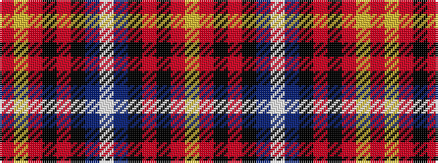

RYRKRKBWBKRKRY

It is a 14 stripe tartan.

<figure class="pat-woven">

<figcaption>idealised sample</figcaption>
</figure>

## Colour Sequence



## Tartans with this colour sequence

| Tartans |
|---------------|
| [Hebridean Granite](/setts/s14/lr4o4k4o18k3n36w3n36k3o18k4o4lr4o3~x2/)|
||
