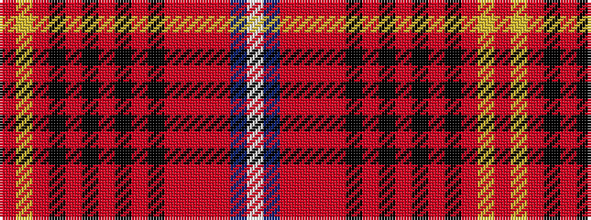

RYRKRKRKRKRRRRBW

It is a 16 stripe tartan.

<figure class="pat-woven">

<figcaption>idealised sample</figcaption>
</figure>

## Colour Sequence



## Tartans with this colour sequence

| Tartans |
|---------------|
| [Mehrtens (Personal)](/variants/s16/w4dt4r18o4r1o36k1o4k6r2k6r6k2r6ly4r2~x2/)|
||
