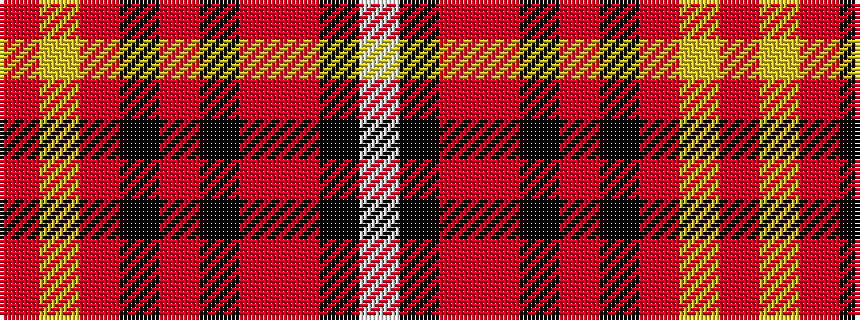

RYRKRKRRKW

It is a 10 stripe tartan.

<figure class="pat-woven">

<figcaption>idealised sample</figcaption>
</figure>

## Colour Sequence



## Tartans with this colour sequence

| Tartans |
|---------------|
| [Motherwell Football Club 1991](/setts/s10/r6ly1r6k3r12k15r1r30k1w2~x2/)|
||
