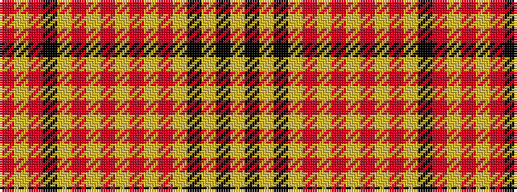

RYRKYRYRYRYRYKYKY

It is a 17 stripe tartan.

<figure class="pat-woven">

<figcaption>idealised sample</figcaption>
</figure>

## Colour Sequence



## Tartans with this colour sequence

| Tartans |
|---------------|
| [Internationale, The](/variants/s17/r4lr2r24k1lr8r2lr1r2lr4r2lr1r2lr16k6ly2k1ly4~x2/)|
||
