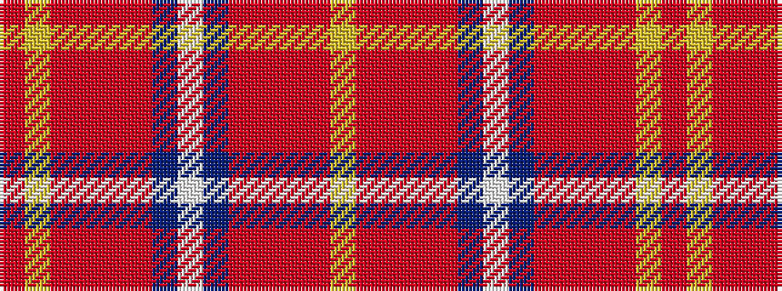

RYRRRRBWBRRRRY

It is a 14 stripe tartan.

<figure class="pat-woven">

<figcaption>idealised sample</figcaption>
</figure>

## Colour Sequence



## Tartans with this colour sequence

| Tartans |
|---------------|
| [Scottish Institute of Sport](/setts/s14/ly4ri23r4ri2r4t19w4t19r4ri2r4ri23ly4ri2~x2/)|
||
