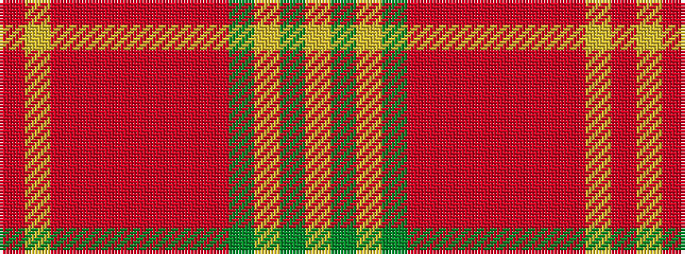

RYRRRRRRRGYGY

It is a 13 stripe tartan.

<figure class="pat-woven">

<figcaption>idealised sample</figcaption>
</figure>

## Colour Sequence



## Tartans with this colour sequence

| Tartans |
|---------------|
| [Strathtay (District?)](/setts/s13/lr6y2lr2y5r20o2r2o25r2o2r4ly10r2~x2/)|
||
