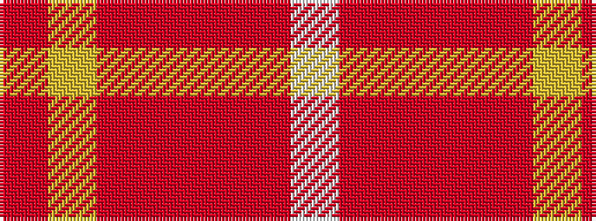

RYRRRRW

It is a 7 stripe tartan.

<figure class="pat-woven">

<figcaption>idealised sample</figcaption>
</figure>

## Colour Sequence



## Tartans with this colour sequence

| Tartans |
|---------------|
| [Banff](/setts/s7/oi6ly3oi20o20oi3o3lb6~x2/)|
||
