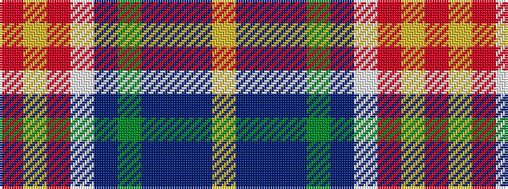

RYRWBGBBBY

It is a 10 stripe tartan.

<figure class="pat-woven">

<figcaption>idealised sample</figcaption>
</figure>

## Colour Sequence



## Tartans with this colour sequence

| Tartans |
|---------------|
| [State Seal of Florida (Fashion)](/setts/s10/r3lo21r14lb3db11g36do3db3do4lo3~x2/)|
||
