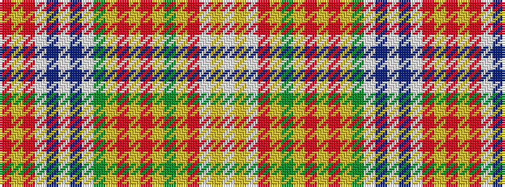

RYRWBWBWGYRYRYGYRWYW

It is a 20 stripe tartan.

<figure class="pat-woven">

<figcaption>idealised sample</figcaption>
</figure>

## Colour Sequence



## Tartans with this colour sequence

| Tartans |
|---------------|
| [Whitworth](/setts/s20/r5ly1r8w1db20w1b20w1g20ly1r5ly1r5ly1g20ly2r52w1ly5w1~x2/)|
||
| [Whitworth Artifact Tartan Tartan Number: 1724. Earliest known date: c.1790-1800 A piece of material 11x8 inches supposedly cut from a plaid worn by Prince Charles during the '45 rebellion. The piece was loaned to the Scottish Tartans Society museum in 1978 by Anthony Whitworth. The tartan expert, James Scarlett, noted that the sample was woven with a flying shuttle and appeared to be of commercial manufacture. He suggests that it may be a commercial copy of one of the many 'Princes Plaids' made c.1790. See products available Copyright © Blair Urquhart, Comrie, 2015](/setts/s20/r5ly1r8w1db20w1t20w1g20ly1r5ly1r5ly1g20ly2r52w1ly5w1~x2/)|
|![Whitworth Artifact Tartan Tartan Number: 1724. Earliest known date: c.1790-1800 A piece of material 11x8 inches supposedly cut from a plaid worn by Prince Charles during the '45 rebellion. The piece was loaned to the Scottish Tartans Society museum in 1978 by Anthony Whitworth. The tartan expert, James Scarlett, noted that the sample was woven with a flying shuttle and appeared to be of commercial manufacture. He suggests that it may be a commercial copy of one of the many 'Princes Plaids' made c.1790. See products available Copyright © Blair Urquhart, Comrie, 2015 example sett](/setts/s20/r5ly1r8w1db20w1t20w1g20ly1r5ly1r5ly1g20ly2r52w1ly5w1~x2/sett.png)|
