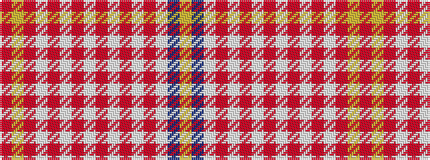

RYRWRWRWRWRWRWBY

It is a 16 stripe tartan.

<figure class="pat-woven">

<figcaption>idealised sample</figcaption>
</figure>

## Colour Sequence



## Tartans with this colour sequence

| Tartans |
|---------------|
| [Bradwell, Carl (Personal)](/setts/s16/r4lr3m2w4m2w3m4w3m6w2m8w2m6w2t4lo3~x2/)|
||
