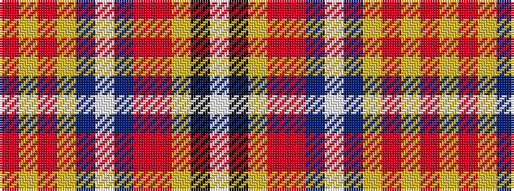

RYRYBWBRRYKW

It is a 12 stripe tartan.

<figure class="pat-woven">

<figcaption>idealised sample</figcaption>
</figure>

## Colour Sequence



## Tartans with this colour sequence

| Tartans |
|---------------|
| [Queens University Alumni (Corporate)](/variants/s12/r50lo8r15lo2dp3w3dp3ri31r13lo3k5w2~x2/)|
||
