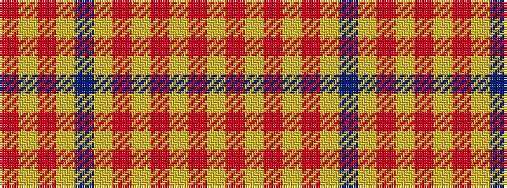

RYRYBYRYRYRY

It is a 12 stripe tartan.

<figure class="pat-woven">

<figcaption>idealised sample</figcaption>
</figure>

## Colour Sequence



## Tartans with this colour sequence

| Tartans |
|---------------|
| [Dublin Irish County Tartan](/variants/s12/r3lg8r2lg18dp5lg3o3lg3o16lg3o3lg3~x2/)|
||
