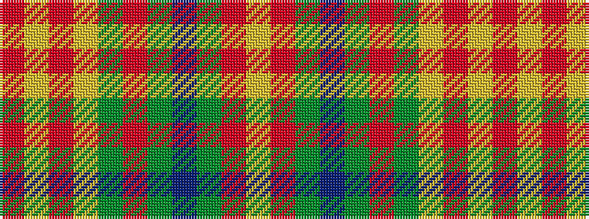

RYRYGRGBGRY

It is a 11 stripe tartan.

<figure class="pat-woven">

<figcaption>idealised sample</figcaption>
</figure>

## Colour Sequence



## Tartans with this colour sequence

| Tartans |
|---------------|
| [Vassseur Mignon ({Personal)](/setts/s11/r2ly2r2ly2g5o5g11n11g5o11ly2~x2/)|
||
