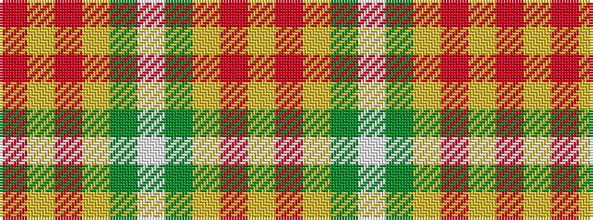

RYRYGWGYRY

It is a 10 stripe tartan.

<figure class="pat-woven">

<figcaption>idealised sample</figcaption>
</figure>

## Colour Sequence



## Tartans with this colour sequence

| Tartans |
|---------------|
| [J & B Whisky (Original) (Corporate)](/setts/s10/ly9r3ly12y16w5y16ly6r3ly7r2~x2/)|
||
