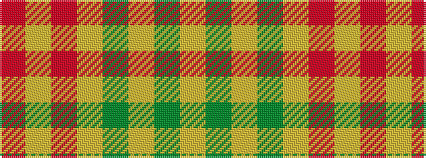

RYRYGYGY

It is a 8 stripe tartan.

<figure class="pat-woven">

<figcaption>idealised sample</figcaption>
</figure>

## Colour Sequence



## Tartans with this colour sequence

| Tartans |
|---------------|
| [Miyuki #4](/setts/s8/r3lo8r3lo20dy20lo3dy8lo3~x2/)|
||
